# AI Agent Pipeline Orchestration Platform Design

## Overview

This design document outlines a production-ready AI agent orchestration platform that enables intelligent code generation through a structured, multi-stage pipeline. The platform combines FastAPI backend services with React frontend interfaces to deliver an integrated experience for requirements refinement, code validation, planning, and prompt-assisted development execution.

The system serves as a comprehensive orchestration layer that transforms high-level project requirements into actionable development workflows, leveraging AI agents for quality assurance, planning intelligence, and execution guidance while maintaining enterprise-grade security, auditability, and operational excellence.

## Technology Stack & Dependencies

### Backend Foundation
- **API Framework**: FastAPI with Pydantic for data validation and OpenAPI documentation
- **Database Layer**: PostgreSQL with JSONB support for flexible schema evolution
- **ORM & Migrations**: SQLAlchemy 2.0 with Alembic for database versioning
- **Task Processing**: Celery with Redis as message broker and result backend
- **State Management**: LangGraph for complex workflow orchestration and state transitions

### Frontend Architecture  
- **UI Framework**: React 18 with TypeScript for type-safe component development
- **Build System**: Vite for fast development and optimized production builds
- **State Management**: Context API with reducer patterns for predictable state updates
- **HTTP Client**: Axios with interceptors for authentication and error handling

### Infrastructure & Operations
- **Authentication**: JWT tokens with secure token refresh mechanisms
- **Encryption**: AES-GCM with envelope encryption (KMS/KeyVault integration)
- **Storage**: S3/Azure Blob for artifact management with versioning
- **Observability**: OpenTelemetry tracing, structured JSON logging, Prometheus metrics
- **Security**: Token masking, secure credential handling, rate limiting

## Architecture

### High-Level System Architecture

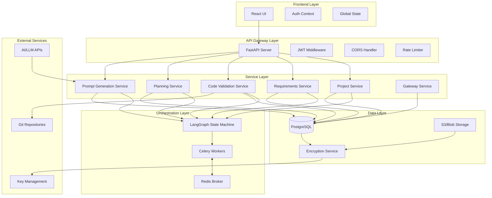

### Pipeline State Machine Architecture

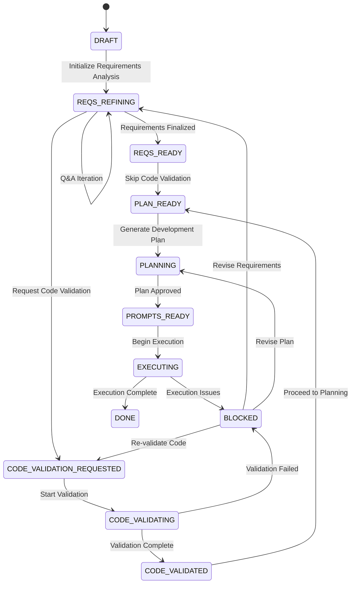

### Component Interaction Flow

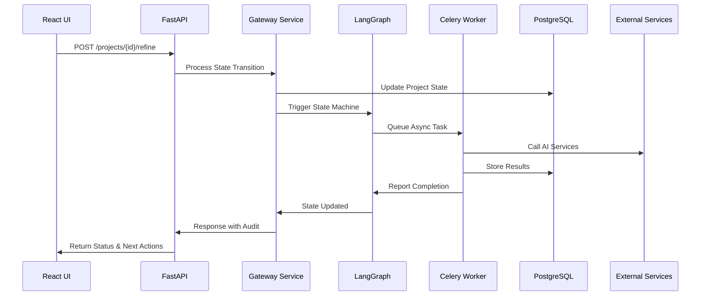

## Data Models & ORM Mapping

### Core Entity Relationships

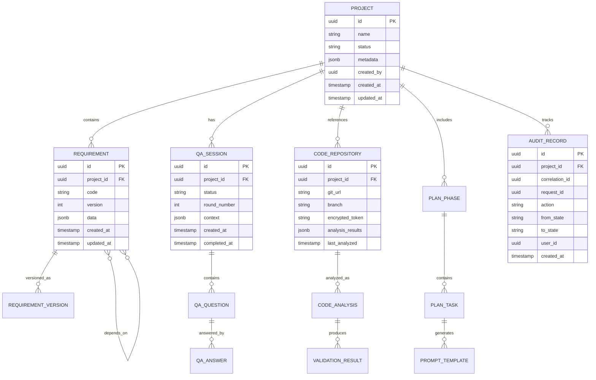

### Data Validation & Constraints

| Model | Field | Validation Rules | Business Logic |
|-------|-------|------------------|----------------|
| Project | name | 1-200 chars, unique per user | Immutable after creation |
| Project | status | Enum values only | State transitions via Gateway |
| Requirement | code | 1-50 chars, unique per project | Alphanumeric with dashes |
| Requirement | dependencies | Valid requirement codes | No circular dependencies |
| QASession | round_number | 1-10 max rounds | Guard rail for infinite loops |
| CodeRepository | git_url | Valid Git URL format | Size limit 100MB |
| CodeRepository | encrypted_token | AES-GCM encrypted | Never stored in plaintext |

## API Endpoints Reference

### Project Management Endpoints

| Method | Endpoint | Description | Auth Required | Idempotent |
|--------|----------|-------------|---------------|------------|
| POST | `/api/v1/projects` | Create new project | Yes | No |
| GET | `/api/v1/projects` | List user projects | Yes | Yes |
| GET | `/api/v1/projects/{id}` | Get project details | Yes | Yes |
| PATCH | `/api/v1/projects/{id}` | Update project | Yes | Yes |
| DELETE | `/api/v1/projects/{id}` | Delete project | Yes | No |

### Requirements Management Endpoints

| Method | Endpoint | Description | Auth Required | Idempotent |
|--------|----------|-------------|---------------|------------|
| POST | `/api/v1/projects/{id}/requirements/bulk` | Bulk upsert requirements | Yes | Yes |
| GET | `/api/v1/projects/{id}/requirements` | List requirements | Yes | Yes |
| GET | `/api/v1/projects/{id}/requirements/{code}/versions` | Requirement history | Yes | Yes |
| POST | `/api/v1/projects/{id}/refine` | Start Q&A refinement | Yes | Yes |
| GET | `/api/v1/projects/{id}/qa-sessions` | List Q&A sessions | Yes | Yes |

### Code Validation Endpoints

| Method | Endpoint | Description | Auth Required | Idempotent |
|--------|----------|-------------|---------------|------------|
| POST | `/api/v1/code/connect` | Connect Git repository | Yes | Yes |
| GET | `/api/v1/code/repositories` | List connected repos | Yes | Yes |
| POST | `/api/v1/projects/{id}/validate-code` | Request code validation | Yes | Yes |
| GET | `/api/v1/projects/{id}/validation-results` | Get validation status | Yes | Yes |

### Planning & Prompt Generation Endpoints

| Method | Endpoint | Description | Auth Required | Idempotent |
|--------|----------|-------------|---------------|------------|
| POST | `/api/v1/projects/{id}/plan` | Generate development plan | Yes | Yes |
| GET | `/api/v1/projects/{id}/plan` | Get current plan | Yes | Yes |
| POST | `/api/v1/projects/{id}/prompts` | Generate execution prompts | Yes | Yes |
| GET | `/api/v1/projects/{id}/prompts` | List generated prompts | Yes | Yes |

### Gateway & Orchestration Endpoints

| Method | Endpoint | Description | Auth Required | Idempotent |
|--------|----------|-------------|---------------|------------|
| POST | `/api/v1/requirements/{id}/gateway` | Process state transition | Yes | Yes |
| GET | `/api/v1/projects/{id}/audit` | Get audit trail | Yes | Yes |
| GET | `/api/v1/projects/{id}/status` | Get detailed status | Yes | Yes |

### Request/Response Schema Examples

#### Project Creation Request
```json
{
  "name": "E-commerce Platform",
  "description": "Modern e-commerce solution",
  "repository_url": "https://github.com/user/repo.git",
  "metadata": {
    "team": "backend",
    "priority": "high"
  }
}
```

#### Requirements Gateway Request
```json
{
  "action": "finalizar",
  "correlation_id": "123e4567-e89b-12d3-a456-426614174000",
  "request_id": "987fcdeb-51a2-43d7-b123-456789abcdef"
}
```

#### Validation Error Response
```json
{
  "detail": {
    "message": "Validation failed for one or more requirements",
    "validation_errors": [
      {
        "index": 0,
        "code": "REQ-001",
        "errors": ["Dependencies not found: REQ-999"]
      }
    ]
  }
}
```

## Business Logic Layer

### Requirements Refinement Architecture

The requirements refinement process employs intelligent heuristics to identify and resolve ambiguities, gaps, and quality issues in project specifications.

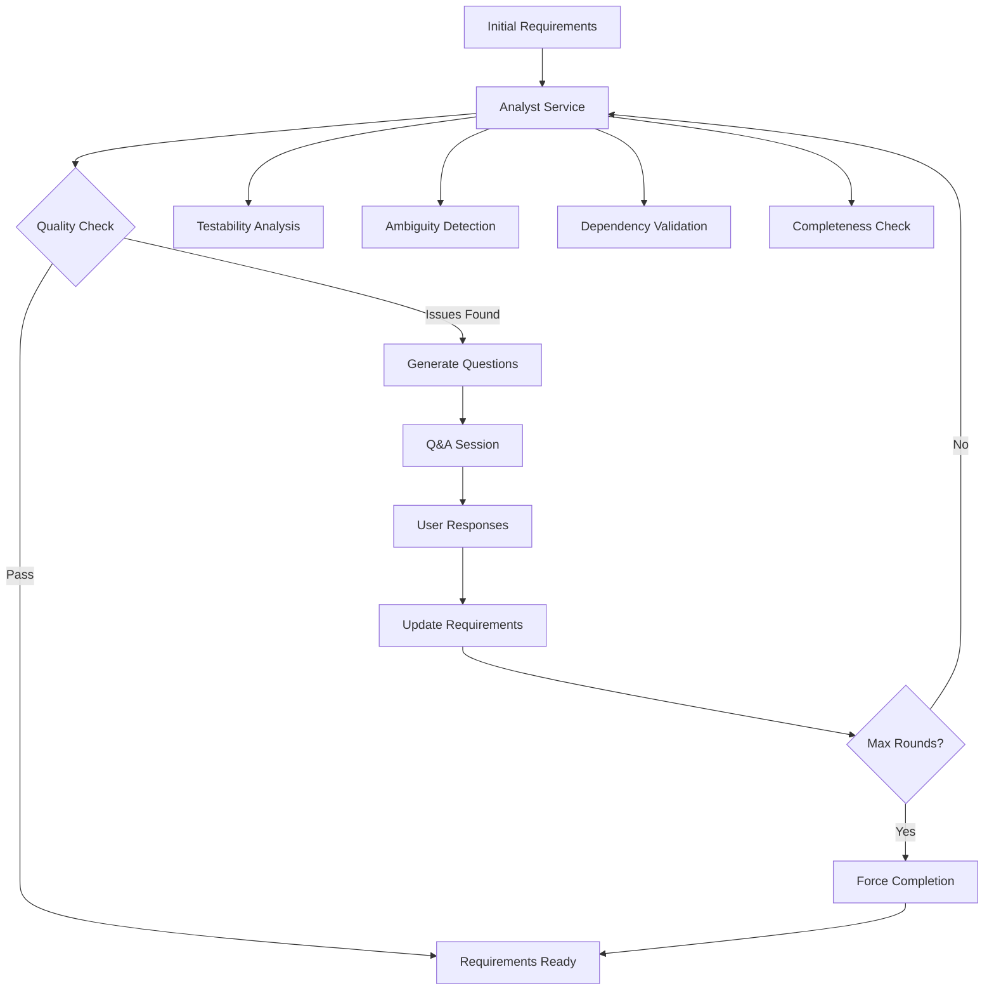

#### Quality Heuristics Implementation

| Heuristic Type | Detection Criteria | Question Generation | Quality Threshold |
|----------------|-------------------|-------------------|------------------|
| Testability | Subjective terms, missing metrics | Quantification requests | >80% measurable criteria |
| Ambiguity | Vague language, multiple interpretations | Clarification questions | <3 ambiguous terms per requirement |
| Dependencies | Missing prerequisites, circular refs | Dependency mapping | 100% valid references |
| Completeness | Missing acceptance criteria, edge cases | Coverage questions | >90% scenario coverage |

### Code Validation Architecture

The code validation system performs heuristic analysis to assess alignment between existing code and refined requirements.

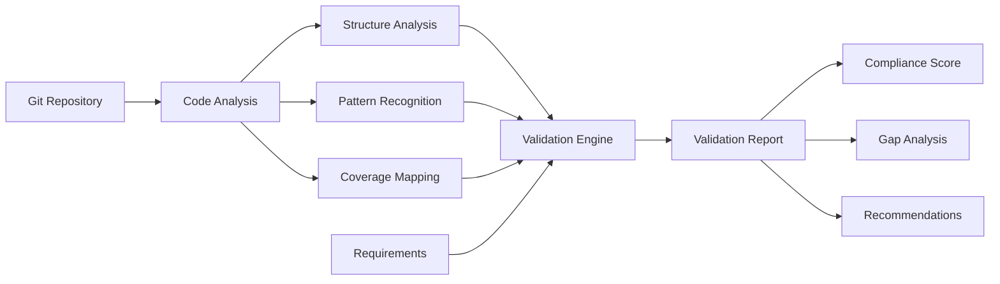

#### Validation Criteria Framework

| Analysis Dimension | Evaluation Method | Scoring Weight | Pass Threshold |
|-------------------|------------------|----------------|----------------|
| Structural Alignment | Component mapping to requirements | 30% | >70% coverage |
| Pattern Compliance | Code patterns vs requirement patterns | 25% | >80% match |
| Functional Coverage | Feature implementation completeness | 35% | >85% implemented |
| Quality Indicators | Code quality metrics alignment | 10% | >60% quality score |

### Planning Architecture

The planning system generates structured development phases with Definition of Done criteria, effort estimation, and risk assessment.

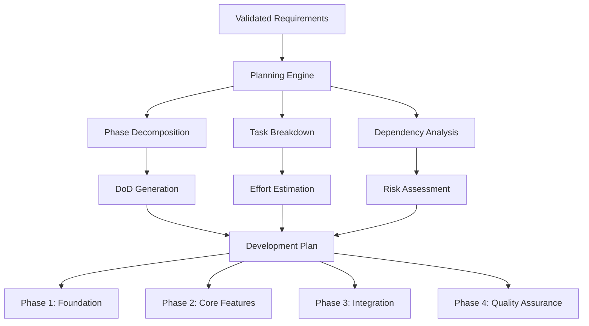

#### Planning Methodology

| Planning Aspect | Approach | Estimation Model | Risk Factors |
|----------------|----------|------------------|--------------|
| Phase Structure | Requirements-driven decomposition | Story point complexity | Dependency complexity, team experience |
| Task Breakdown | Functional and technical separation | Historical velocity data | Technology unknowns, integration points |
| DoD Criteria | Quality gate definitions | Acceptance criteria mapping | Testing complexity, review requirements |
| Risk Assessment | Impact vs probability matrix | Monte Carlo simulation | External dependencies, resource availability |

### Prompt Generation Architecture

The prompt generation system creates context-aware, executable prompts for each development phase, optimized for AI-assisted development.

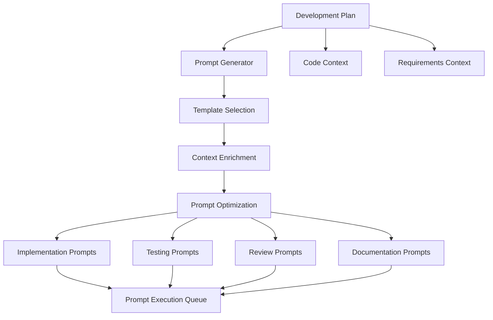

#### Prompt Template Categories

| Template Type | Purpose | Context Requirements | Output Format |
|--------------|---------|---------------------|---------------|
| Implementation | Code generation guidance | Requirements, architecture, dependencies | Structured development steps |
| Testing | Test strategy and cases | Requirements, implementation patterns | Test scenarios and assertions |
| Review | Code review criteria | Quality standards, requirements compliance | Review checklist and criteria |
| Documentation | Technical documentation | Implementation details, user scenarios | Documentation structure and content |

## Middleware & Interceptors

### Authentication & Authorization Flow

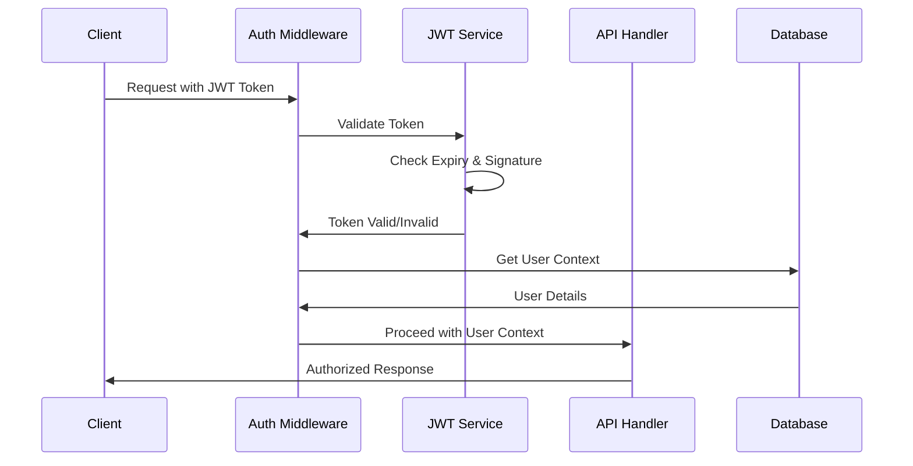

### Security Middleware Stack

| Middleware Layer | Responsibility | Implementation | Configuration |
|-----------------|----------------|----------------|---------------|
| CORS Handler | Cross-origin request validation | FastAPI CORSMiddleware | Environment-based origins |
| Rate Limiter | Request throttling protection | Token bucket algorithm | Per-user and global limits |
| Auth Validator | JWT token verification | Custom FastAPI dependency | RSA signature validation |
| Request Logger | Audit trail creation | Structured JSON logging | PII masking rules |
| Error Handler | Exception normalization | Global exception middleware | Status code mapping |

### Encryption Service Architecture

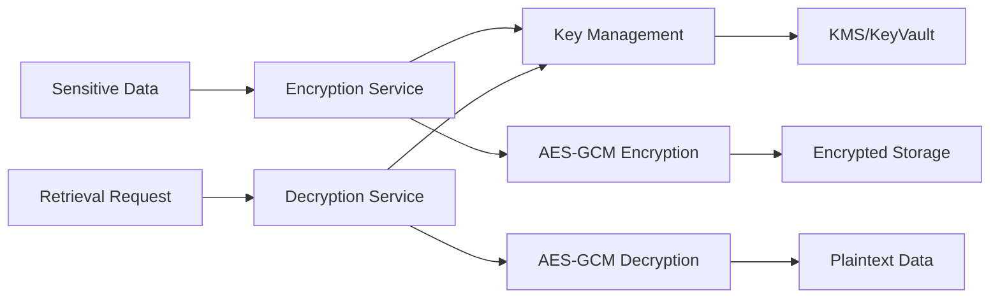

#### Encryption Standards

| Data Type | Encryption Method | Key Rotation | Storage Location |
|-----------|------------------|--------------|------------------|
| Git Tokens | AES-256-GCM with envelope encryption | 90-day automatic | PostgreSQL JSONB |
| User Credentials | Bcrypt with salt | User-initiated | PostgreSQL text |
| API Keys | AES-256-GCM with envelope encryption | 30-day automatic | Environment variables |
| Session Data | JWT with RS256 signature | Token expiry-based | Client-side storage |

## Asynchronous Task Processing

### Celery Architecture & Queue Design

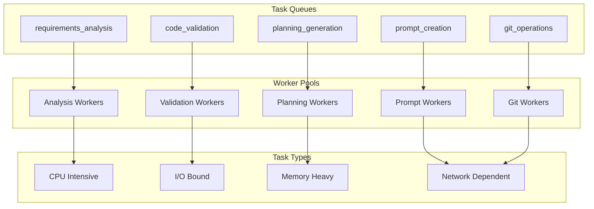

### Task Configuration & Concurrency

| Queue Name | Worker Count | Concurrency | Timeout | Priority | Use Case |
|------------|-------------|-------------|---------|----------|----------|
| requirements_analysis | 2 | 4 | 300s | High | Q&A generation, heuristic analysis |
| code_validation | 3 | 2 | 600s | Medium | Git clone, code analysis |
| planning_generation | 2 | 3 | 180s | Medium | Plan creation, estimation |
| prompt_creation | 4 | 6 | 120s | Low | Template processing, optimization |
| git_operations | 1 | 1 | 900s | High | Repository operations, security |

### Idempotency Implementation

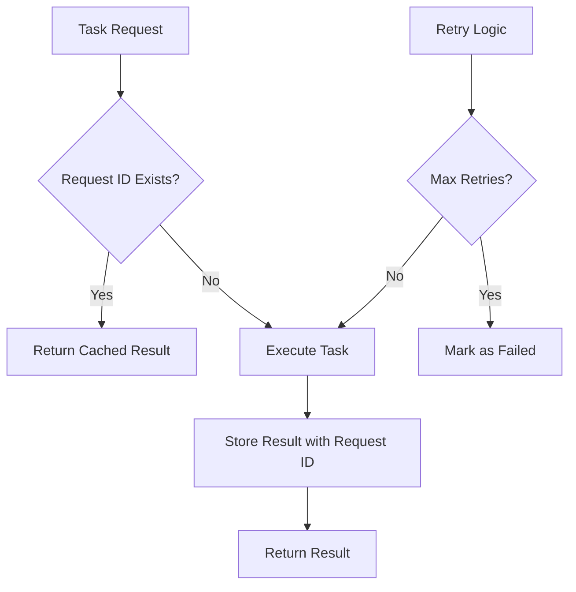

#### Idempotency Strategy

| Operation Type | Idempotency Key | Cache Duration | Conflict Resolution |
|---------------|-----------------|----------------|-------------------|
| Requirements Analysis | project_id + request_id | 24 hours | Latest wins |
| Code Validation | repo_url + commit_hash | 7 days | Immutable |
| Plan Generation | project_id + requirements_hash | 48 hours | Version comparison |
| Prompt Creation | plan_id + template_version | 12 hours | Template precedence |

## State Management & Orchestration

### LangGraph State Machine Implementation

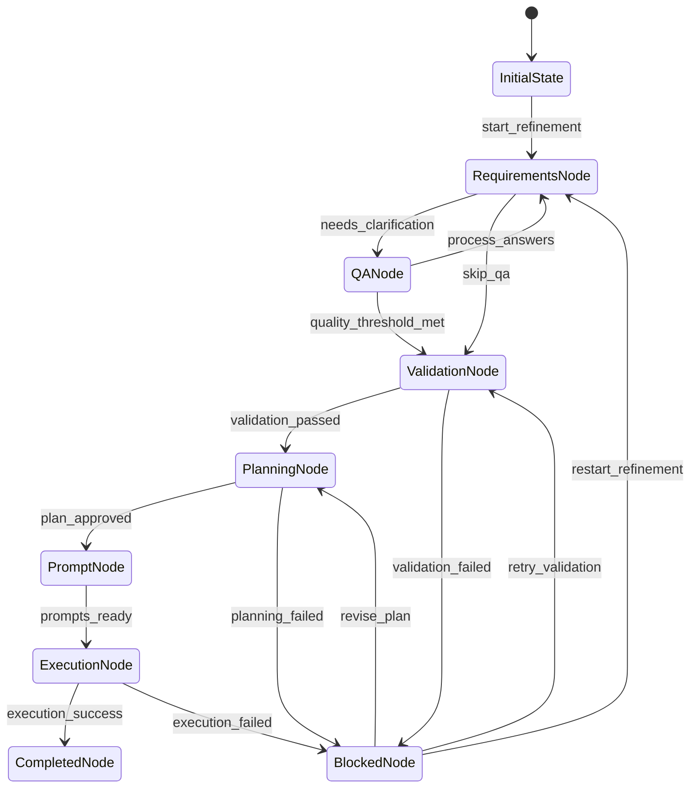

### State Transition Logic

| Current State | Trigger Event | Next State | Validation Rules | Side Effects |
|--------------|---------------|------------|------------------|--------------|
| DRAFT | initialize_requirements | REQS_REFINING | Project must exist | Create QA session |
| REQS_REFINING | complete_qa_round | REQS_REFINING \| REQS_READY | Quality threshold check | Update requirements |
| REQS_READY | request_validation | CODE_VALIDATION_REQUESTED | Repository connected | Queue validation task |
| CODE_VALIDATED | approve_validation | PLAN_READY | Validation score >70% | Trigger planning |
| PLAN_READY | generate_prompts | PROMPTS_READY | Plan completeness check | Create prompt templates |
| PROMPTS_READY | begin_execution | EXECUTING | All prompts generated | Initialize execution queue |

### Context Management

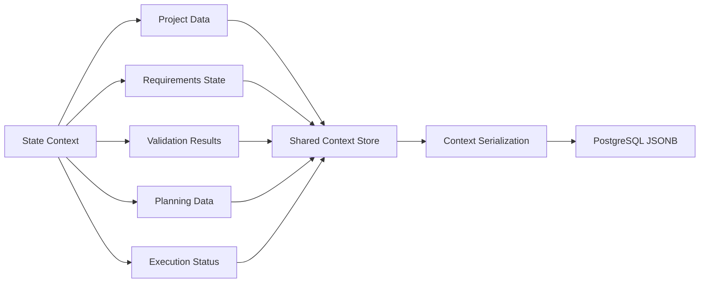

## Testing Strategy

### Testing Pyramid Architecture

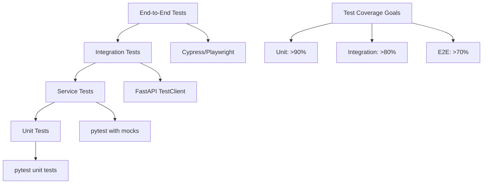

### Test Categories & Coverage

| Test Level | Framework | Coverage Target | Execution Time | Purpose |
|------------|-----------|----------------|----------------|---------|
| Unit Tests | pytest | >90% | <5 min | Function-level validation |
| Service Tests | pytest + TestClient | >80% | <15 min | Service layer integration |
| API Integration | pytest + database | >75% | <30 min | End-to-end API flows |
| Workflow Tests | pytest + Celery test mode | >70% | <45 min | Complete pipeline validation |

### Test Data Management

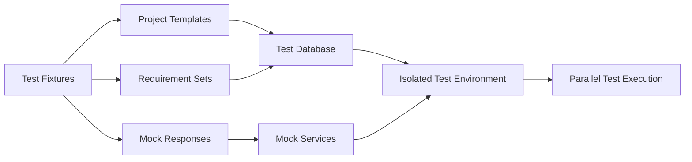

#### Test Infrastructure

| Component | Implementation | Isolation Level | Data Management |
|-----------|----------------|-----------------|-----------------|
| Database | SQLite in-memory | Per test function | Automatic cleanup |
| Redis | fakeredis library | Per test session | Memory-based |
| External APIs | Mock services | Test suite level | Recorded responses |
| File System | Temporary directories | Per test function | Automatic deletion |

### Module-Specific Test Suites

#### Code Repository Testing (C1 Tests)

The C1 test suite validates the secure Git repository connection functionality that was previously implemented. This comprehensive testing structure mirrors the established testing patterns used in other pipeline modules (such as R4 Requirements Gateway tests) and ensures the code repository connection feature operates correctly with proper security, validation, and error handling.

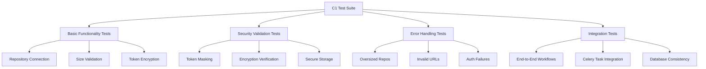

#### C1 Test Structure Organization

| Test File | Purpose | Coverage | Execution Time |
|-----------|---------|----------|----------------|
| `test_c1_basic.sh` | Basic repository connection validation | Core API functionality | ~30s |
| `test_c1_security.sh` | Security-focused validation tests | Token encryption, masking | ~45s |
| `test_c1_e2e.sh` | Complete workflow testing | End-to-end repository management | ~60s |
| `test_c1_direct.py` | Automated Python test suite | Comprehensive scenario coverage | ~90s |
| `test_c1_cleanup.sh` | Safe test data cleanup | Test repository removal | ~15s |
| `README.md` | Test suite documentation | Usage guide and troubleshooting | - |
| `C1_SECURITY_GUIDE.md` | Security testing documentation | Encryption and token handling | - |
| `C1_INTEGRATION_GUIDE.md` | Integration testing guide | End-to-end workflow validation | - |

#### Test Scenarios Coverage

**Basic Functionality Tests (`test_c1_basic.sh`):**
- Repository connection with valid Git URLs (GitHub, GitLab, Bitbucket, Generic)
- Size pre-validation using shallow clone and pack estimation
- Token encryption with AES-GCM envelope encryption pattern
- Repository status tracking through PENDING → CLONING → COMPLETED states
- Sandbox directory creation with proper isolation
- Database record creation with encrypted token storage

**Security Validation Tests (`test_c1_security.sh`):**
- Token masking in all log outputs and API responses
- AES-GCM encryption verification with proper key management
- Key Management Service (KMS) integration validation
- Secure token decryption for authorized operations only
- Prevention of token exposure in error messages and stack traces
- Audit trail creation for all security-sensitive operations

**Error Handling Tests (within basic and e2e scripts):**
- Repository size limit enforcement (>100MB rejection with HTTP 413)
- Invalid Git URL format validation with detailed error messages
- Authentication failure handling with proper HTTP status codes
- Network timeout and retry logic for unreliable connections
- Database transaction rollback on operation failures
- Cleanup of partial operations on error conditions

**End-to-End Integration Tests (`test_c1_e2e.sh`):**
- Complete workflow: Connect → Validate → Clone → Status Update
- Celery task queue integration for asynchronous repository cloning
- Database consistency verification across all service operations
- Project-repository relationship validation and cascade operations
- Idempotency verification using request IDs for duplicate operations
- Multi-repository handling within single project context

**Python Automated Tests (`test_c1_direct.py`):**
- Comprehensive API endpoint testing with various input combinations
- Mock-based unit testing for service layer components
- Security assertion validation for encryption and token handling
- Performance validation for repository size estimation
- Concurrent operation testing for race condition detection
- Error boundary testing with edge case scenarios

#### Test Data Management Patterns

**Repository Test Data Strategy:**
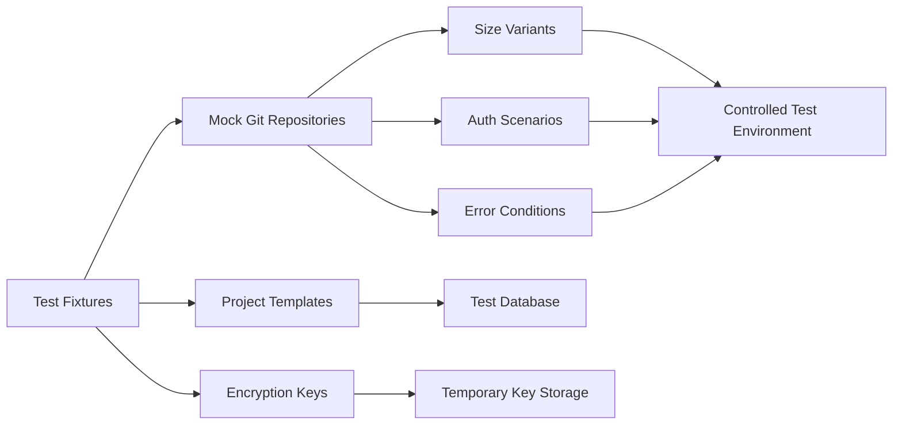

**Safety and Cleanup Patterns:**
- Test repositories use predictable naming conventions (`Test C1 - *`)
- Sandbox directories isolated in temporary test-specific locations
- Automated cleanup removes only test-generated data with safety checks
- Database transactions scoped to individual test cases with rollback
- Mock encryption keys used for deterministic testing without real KMS
- Comprehensive cleanup scripts with dry-run capabilities

#### Repository Connection Validation Matrix

| Git Platform | URL Pattern | Auth Method | Size Limits | Expected Results |
|--------------|-------------|-------------|-------------|------------------|
| GitHub | `https://github.com/user/repo.git` | Token-based | 100MB limit | Success with token masking |
| GitLab | `https://gitlab.com/user/repo.git` | OAuth2 token | 100MB limit | Success with oauth2 prefix |
| Bitbucket | `https://bitbucket.org/user/repo.git` | App password | 100MB limit | Success with x-token-auth |
| Generic Git | `https://custom.git/repo.git` | Basic auth | 100MB limit | Success with fallback auth |
| Oversized Repo | Any valid URL | Valid token | >100MB | HTTP 413 rejection |
| Invalid URL | Malformed URL | Any token | Any size | HTTP 422 validation error |
| Bad Token | Valid URL | Invalid token | <100MB | HTTP 401 authentication error |

#### Security Testing Validation

**Encryption Verification Tests:**
- Token encryption produces different ciphertext for identical inputs
- Encrypted tokens are never logged or exposed in API responses
- Decryption requires proper project context and authorization
- Key rotation scenarios handled gracefully without data loss
- Envelope encryption pattern correctly implemented with KMS integration

**Access Control Testing:**
- Repository access restricted to project team members
- Token decryption limited to authorized service operations
- Audit trails capture all access attempts and security events
- Rate limiting prevents brute force token discovery attempts
- Secure deletion of tokens when repositories are disconnected

## Security Architecture

### Authentication & Authorization Model

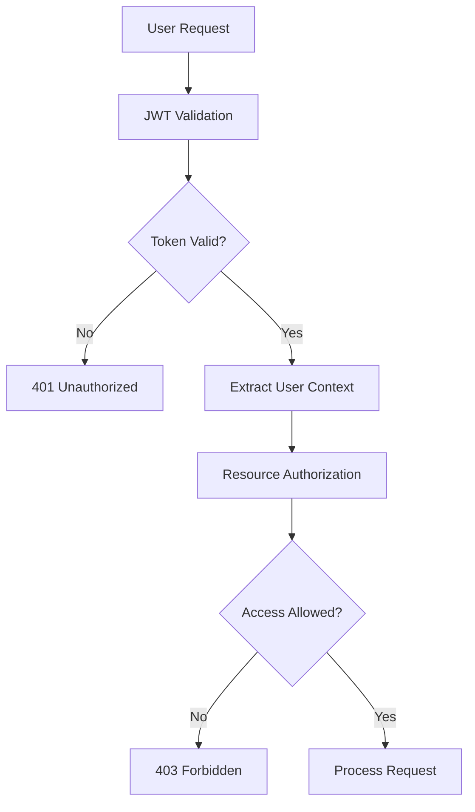

### Data Protection Strategy

| Data Classification | Protection Method | Access Controls | Audit Requirements |
|-------------------|------------------|-----------------|-------------------|
| User Credentials | Bcrypt hashing | Owner-only access | Login events logged |
| Git Tokens | AES-GCM encryption | Project team access | All operations logged |
| Project Data | Database-level encryption | Role-based access | Change tracking |
| System Logs | Field-level masking | Admin-only access | Retention policies |

### Threat Mitigation

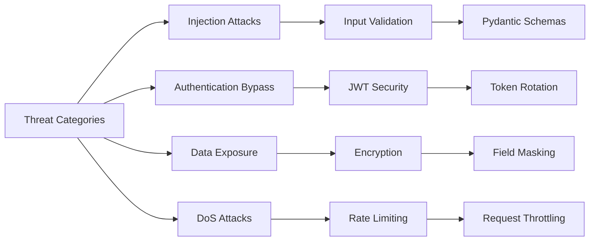

## Observability & Monitoring

### Logging Architecture

```mermaid
flowchart TB
    A[Application Logs] --> B[Structured JSON]
    B --> C[Log Aggregation]
    C --> D[Central Log Store]
    
    E[Metrics Collection] --> F[Prometheus]
    F --> G[Grafana Dashboards]
    
    H[Distributed Tracing] --> I[OpenTelemetry]
    I --> J[Jaeger/Zipkin]
    
    D --> K[Log Analysis]
    G --> L[Alerting]
    J --> M[Performance Analysis]
```

### Key Performance Indicators

| Metric Category | Key Metrics | Target Values | Alert Thresholds |
|----------------|-------------|---------------|------------------|
| API Performance | Response time p50/p95 | <200ms / <500ms | >1s p95 |
| Task Processing | Queue depth, processing time | <10 pending / <30s avg | >100 pending |
| System Health | CPU, memory, disk usage | <70% / <80% / <90% | >90% sustained |
| Business Metrics | Project completion rate, user satisfaction | >85% / >4.0/5.0 | <70% / <3.0/5.0 |

### Error Handling & Recovery

```mermaid
stateDiagram-v2
    [*] --> Normal
    Normal --> Error: Exception Occurred
    Error --> Retry: Retryable Error
    Error --> Failed: Non-retryable Error
    Retry --> Normal: Success
    Retry --> Failed: Max Retries Exceeded
    Failed --> Recovery: Manual Intervention
    Recovery --> Normal: Issue Resolved
```

#### Recovery Strategies

| Error Type | Detection Method | Recovery Action | Escalation Path |
|------------|-----------------|-----------------|-----------------|
| Database Connection | Health check failure | Connection pool refresh | Database team notification |
| External API Failure | HTTP status codes | Exponential backoff retry | Service degradation mode |
| Task Queue Overflow | Queue depth monitoring | Auto-scaling workers | Operations team alert |
| Memory Exhaustion | Process monitoring | Graceful restart | Infrastructure scaling |

## Deployment & Infrastructure

### Container Architecture

```mermaid
graph TB
    subgraph "Production Environment"
        A[Load Balancer]
        B[FastAPI Containers]
        C[Celery Workers]
        D[Redis Cluster]
        E[PostgreSQL Primary/Replica]
        F[Monitoring Stack]
    end
    
    A --> B
    B --> D
    B --> E
    C --> D
    C --> E
    
    G[CI/CD Pipeline] --> H[Container Registry]
    H --> B
    H --> C
```

### Scalability Considerations

| Component | Scaling Strategy | Bottleneck Indicators | Scaling Triggers |
|-----------|-----------------|----------------------|------------------|
| API Servers | Horizontal pod autoscaling | CPU >70%, Memory >80% | Response time >500ms |
| Celery Workers | Queue-based scaling | Queue depth >50 | Processing time >2x baseline |
| Database | Read replicas, connection pooling | Connection pool exhaustion | >80% connection utilization |
| Redis | Cluster configuration | Memory usage >80% | High memory pressure |

### Configuration Management

```mermaid
flowchart LR
    A[Environment Variables] --> B[Configuration Service]
    B --> C[Application Config]
    B --> D[Database Config]
    B --> E[Security Config]
    
    F[Secrets Management] --> G[Vault/K8s Secrets]
    G --> H[Encrypted Values]
    H --> B
    
    I[Feature Flags] --> J[Dynamic Configuration]
    J --> C
```

This design document provides the architectural foundation for implementing a production-ready AI agent pipeline orchestration platform. The design emphasizes modularity, security, scalability, and maintainability while providing clear guidance for implementation teams to deliver robust, enterprise-grade functionality.