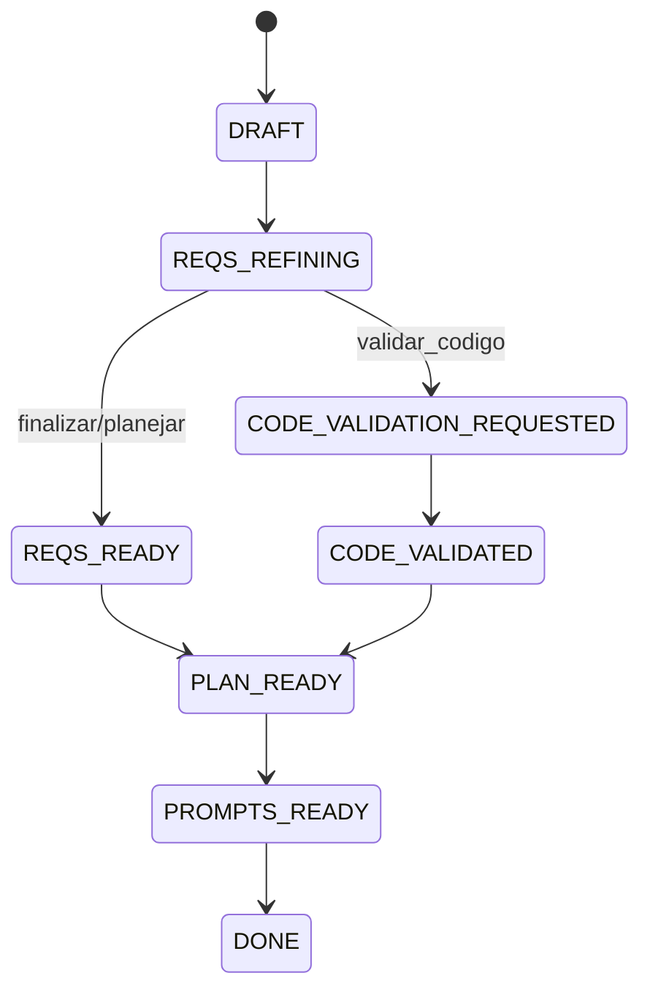
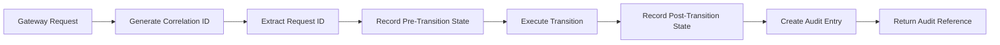

# Requirements Gateway (R4) - Design Document

## Overview

The Requirements Gateway (R4) provides controlled state transitions for projects exiting the requirements refinement phase. It serves as the decision point where users determine the next step after requirements have been refined through the Q&A process.

This component ensures proper state management, audit trail creation, and guards against invalid transitions while enabling three distinct workflow paths: finalizing requirements, proceeding to planning, or initiating code validation.

## Architecture

### State Machine Integration

The gateway integrates with the existing project state machine, handling transitions from `REQS_REFINING` state to:
- `REQS_READY` (finalize/plan actions)
- `CODE_VALIDATION_REQUESTED` (validate_code action)



### Core Components

| Component | Responsibility |
|-----------|---------------|
| Gateway Route | HTTP endpoint handling user decisions |
| State Validator | Validates current project state before transition |
| Transition Engine | Executes state changes with business logic |
| Audit Service | Records transition events with correlation tracking |
| Guard System | Prevents invalid state transitions |

## API Endpoint Reference

### POST /requirements/{project_id}/gateway

Controls project state transitions based on user decisions after requirements refinement.

#### Request Schema

| Field | Type | Required | Description |
|-------|------|----------|-------------|
| action | string | Yes | Decision type: `finalizar`, `planejar`, or `validar_codigo` |
| correlation_id | string | No | Optional correlation ID for tracking |
| request_id | string | No | Idempotency key (auto-generated if omitted) |

#### Response Schema

| Field | Type | Description |
|-------|------|-------------|
| from | string | Previous project state |
| to | string | New project state |
| reason | string | Transition reason based on action |
| audit_ref | object | Audit trail reference with correlation data |

#### State Transition Table

| Current State | Action | Target State | Valid |
|---------------|---------|--------------|-------|
| REQS_REFINING | finalizar | REQS_READY | ✅ |
| REQS_REFINING | planejar | REQS_READY | ✅ |
| REQS_REFINING | validar_codigo | CODE_VALIDATION_REQUESTED | ✅ |
| DRAFT | any | - | ❌ 400 |
| REQS_READY | any | - | ❌ 400 |
| CODE_VALIDATION_REQUESTED | any | - | ❌ 400 |

#### Response Examples

**Successful Transition:**
```json
{
  "from": "REQS_REFINING",
  "to": "REQS_READY",
  "reason": "User chose to finalize requirements",
  "audit_ref": {
    "correlation_id": "corr-123-456",
    "request_id": "req-789-012",
    "project_id": "550e8400-e29b-41d4-a716-446655440000",
    "timestamp": "2024-01-15T10:30:45.123Z",
    "action": "finalizar",
    "user_id": null
  }
}
```

**Invalid State Error:**
```json
{
  "detail": "Invalid state transition: project in DRAFT state cannot transition via gateway",
  "error_code": "INVALID_STATE_TRANSITION",
  "current_state": "DRAFT",
  "requested_action": "finalizar"
}
```

## Business Logic Layer

### Action Processing Logic

Each action type implements specific business rules:

#### Finalizar Action
- **Purpose**: Mark requirements as complete without further processing
- **Target State**: `REQS_READY`
- **Business Rule**: Requirements are considered final and ready for external review
- **Next Step**: Manual progression to planning or other workflows

#### Planejar Action  
- **Purpose**: Mark requirements ready and signal intent to proceed to planning
- **Target State**: `REQS_READY`
- **Business Rule**: Requirements are complete and project should advance to planning phase
- **Next Step**: Automatic or manual progression to planning workflow

#### Validar Codigo Action
- **Purpose**: Request code validation against refined requirements
- **Target State**: `CODE_VALIDATION_REQUESTED`
- **Business Rule**: Existing code needs validation against updated requirements
- **Next Step**: Code validation workflow initiation

### Transition Guards

The system implements validation guards to ensure state consistency:

| Guard Type | Validation Rule |
|------------|----------------|
| State Guard | Only `REQS_REFINING` projects can use gateway |
| Project Guard | Project must exist and be accessible |
| Action Guard | Action must be one of three valid options |
| Requirements Guard | Project must have at least one requirement |

### Audit Trail Architecture

The audit system captures comprehensive transition metadata:



#### Audit Data Model

| Field | Type | Purpose |
|-------|------|---------|
| correlation_id | UUID | Groups related operations across services |
| request_id | UUID | Enables idempotent operations |
| project_id | UUID | Links audit to specific project |
| timestamp | ISO DateTime | Records exact transition time |
| action | String | User's chosen action |
| from_state | String | Previous project state |
| to_state | String | New project state |
| user_id | UUID | User who initiated transition (nullable for now) |

## Database Schema Impact

### Requirements Gateway Audit Table

The system will extend the existing audit pattern with gateway-specific tracking:

| Column | Type | Constraints | Description |
|---------|------|------------|-------------|
| id | UUID | PRIMARY KEY | Unique audit record identifier |
| project_id | UUID | FOREIGN KEY, NOT NULL | Reference to projects table |
| correlation_id | UUID | NOT NULL, INDEXED | Groups related operations |
| request_id | UUID | UNIQUE, NOT NULL | Idempotency key |
| action | VARCHAR(20) | NOT NULL | Gateway action taken |
| from_state | VARCHAR(50) | NOT NULL | State before transition |
| to_state | VARCHAR(50) | NOT NULL | State after transition |
| user_id | UUID | NULLABLE | User who performed action |
| created_at | TIMESTAMP | DEFAULT NOW() | Audit record creation time |

### Migration Requirements

The implementation requires a new migration to:
- Create gateway audit table
- Add indexes for performance optimization
- Establish foreign key relationships
- Set up appropriate constraints

## Error Handling Strategy

### Error Response Format

All errors follow consistent FastAPI error response patterns:

| Status Code | Scenario | Response Structure |
|-------------|----------|-------------------|
| 400 | Invalid state transition | `{"detail": "message", "error_code": "INVALID_STATE_TRANSITION"}` |
| 404 | Project not found | `{"detail": "Project not found"}` |
| 422 | Invalid request data | Pydantic validation errors |
| 500 | System error | `{"detail": "Internal server error"}` |

### Error Recovery Patterns

- **Idempotency**: Same request_id returns previous result if transition already completed
- **State Validation**: Pre-flight checks prevent invalid transitions
- **Rollback Strategy**: Database transactions ensure consistency
- **Audit Integrity**: Failed transitions still generate audit records

## Integration Patterns

### Existing System Integration

The gateway integrates with established patterns:

| Integration Point | Pattern | Implementation |
|------------------|---------|----------------|
| State Management | Direct database update | Updates `projects.status` field |
| Logging | Structured JSON logging | Uses existing logger with project_id context |
| Validation | Pydantic schemas | Extends existing validation patterns |
| Database Access | SQLAlchemy ORM | Uses existing session management |

### Future Workflow Integration

The gateway prepares for future workflow integrations:

- **Planning Service**: Projects in `REQS_READY` state are eligible for planning
- **Code Validation**: Projects in `CODE_VALIDATION_REQUESTED` trigger validation workflows
- **Notification System**: Audit events can trigger notifications to stakeholders

## Testing Strategy

### Unit Testing Approach

| Test Category | Coverage |
|---------------|----------|
| State Transitions | All valid and invalid transition combinations |
| Audit Trail | Correlation ID generation and audit record creation |
| Error Handling | Each error condition and response format |
| Idempotency | Duplicate request handling |
| Input Validation | Schema validation and edge cases |

### Integration Testing Scenarios

- End-to-end workflow: requirements refinement → gateway → next phase
- Database consistency: verify state changes persist correctly
- Concurrent access: multiple users accessing same project
- Error recovery: system behavior during failures

### Test Data Requirements

| Scenario | Project State | Expected Outcome |
|----------|---------------|------------------|
| Valid Finalize | REQS_REFINING | Transition to REQS_READY |
| Valid Plan | REQS_REFINING | Transition to REQS_READY |
| Valid Validate | REQS_REFINING | Transition to CODE_VALIDATION_REQUESTED |
| Invalid State | DRAFT | 400 error response |
| Missing Project | N/A | 404 error response |
| Duplicate Request | Any | Idempotent response |

## Performance Considerations

### Database Performance

- **Indexing Strategy**: Index on project_id, correlation_id, and request_id for fast lookups
- **Query Optimization**: Single query for state validation and update
- **Connection Pooling**: Leverage existing SQLAlchemy connection management

### Response Time Targets

| Operation | Target Response Time |
|-----------|---------------------|
| Successful Transition | < 100ms |
| State Validation Error | < 50ms |
| Project Not Found | < 50ms |

## Security Considerations

### Access Control

- **Project Access**: Verify user has access to project (placeholder for future RBAC)
- **State Validation**: Prevent unauthorized state manipulation
- **Audit Integrity**: Ensure audit records cannot be tampered with

### Input Sanitization

- **Action Validation**: Strict whitelist of allowed actions
- **Project ID Validation**: UUID format validation
- **Request ID Validation**: UUID format and uniqueness validation

## Monitoring and Observability

### Metrics to Track

| Metric | Purpose |
|--------|---------|
| Transition Success Rate | Monitor system reliability |
| Action Distribution | Understand user behavior patterns |
| Response Times | Performance monitoring |
| Error Rates by Type | Identify common failure modes |

### Logging Strategy

Each gateway operation generates structured logs including:
- Project ID and current state
- User action and target state
- Correlation and request IDs
- Processing duration
- Success/failure status

## Deployment Considerations

### Database Migration

The gateway requires a new Alembic migration:
- Create audit table with proper indexes
- Ensure migration is reversible
- Test migration on development data

### Configuration Management

No new configuration parameters required - gateway uses existing:
- Database connection settings
- Logging configuration
- API routing configuration

### Rollback Strategy

If deployment issues arise:
- Database migration can be rolled back via Alembic
- API endpoint can be disabled via feature flag
- Existing functionality remains unaffected